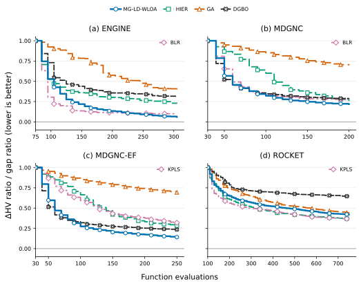
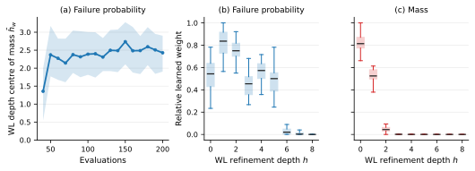
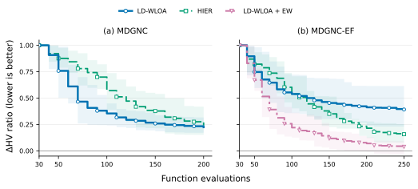
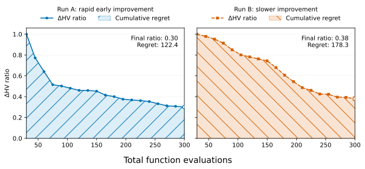

# Graph-Kernel Gaussian Processes for System Architecture Optimization

Research code and retained experiment artifacts for graph-kernel Gaussian-process
surrogates in System Architecture Optimization.

System Architecture Optimization (SAO) problems are mixed-discrete, hierarchical,
and often expensive to evaluate. Existing Bayesian-optimization methods compare
encoded design vectors; this project instead compares the **resolved architecture
graphs** produced by those vectors. The proposed Gaussian-process surrogate combines
graph structure, design-parameter values, and—where present—edge multiplicity.

Its main structural kernel is **multi-granularity learned-depth Weisfeiler-Lehman
optimal assignment (MG-LD-WLOA)**. It learns which neighborhood depths and which
architectural label granularities are useful for each modeled response.

[Results](#results) · [Method](#method) · [Benchmarks](#benchmarks-and-metrics) ·
[Installation](#installation) · [Reproducing experiments](#running-and-reproducing-experiments) ·
[License](#license)

---

## Results

The final comparison uses 40 independent runs with seeds disjoint from the ablation
studies. Lower values are better. ENGINE uses a normalized single-objective gap;
MDGNC, MDGNC-EF, and ROCKET use a normalized hypervolume error.



_Optimization performance on the four benchmark problems. Curves closer to zero are
better._

> **Reading the tables:** values are mean ± standard deviation; the best mean in each
> problem column is **bold**. Lower is better for both metrics.

### Cumulative regret

Regret is the area under the normalized error curve, so it rewards methods that
improve early as well as those that finish well.

| Method | ENGINE | MDGNC | MDGNC-EF | ROCKET |
|---|---:|---:|---:|---:|
| Random | 191.01 ± 39.71 | 145.03 ± 12.31 | 191.34 ± 11.62 | 413.36 ± 89.06 |
| GA | 148.85 ± 52.59 | 140.74 ± 11.67 | 178.88 ± 11.03 | 388.89 ± 97.29 |
| HIER | 81.62 ± 48.08 | 92.39 ± 17.67 | 118.19 ± 19.64 | 318.77 ± 76.83 |
| KPLS | 67.51 ± 47.25 | 84.64 ± 12.25 | 116.47 ± 16.79 | **309.18 ± 83.34** |
| BLR | **40.21 ± 24.17** | 66.99 ± 13.14 | 108.16 ± 19.95 | 528.10 ± 51.22 |
| SP-RBF | 47.91 ± 24.09 | 77.27 ± 13.31 | 89.38 ± 11.52 | 401.08 ± 86.90 |
| Arch2Vec | 96.62 ± 63.57 | 85.31 ± 16.69 | 119.47 ± 23.01 | 531.74 ± 54.61 |
| DGBO | 99.39 ± 68.11 | 65.89 ± 15.76 | 73.49 ± 16.61 | 466.11 ± 103.48 |
| MG-LD-WLOA | 50.34 ± 22.37 | **61.34 ± 8.32** | **64.95 ± 11.76** | 352.59 ± 83.50 |

### Final normalized error

The final ratio is the fraction of the initial optimality or hypervolume error that
remains at the end of the evaluation budget.

| Method | ENGINE gap ratio | MDGNC ΔHV ratio | MDGNC-EF ΔHV ratio | ROCKET ΔHV ratio |
|---|---:|---:|---:|---:|
| Random | 0.646 ± 0.281 | 0.783 ± 0.082 | 0.810 ± 0.056 | 0.492 ± 0.150 |
| GA | 0.388 ± 0.247 | 0.698 ± 0.082 | 0.694 ± 0.064 | 0.437 ± 0.138 |
| HIER | 0.227 ± 0.186 | 0.256 ± 0.128 | 0.284 ± 0.106 | 0.369 ± 0.117 |
| KPLS | 0.166 ± 0.171 | 0.273 ± 0.075 | 0.319 ± 0.074 | **0.367 ± 0.110** |
| BLR | 0.100 ± 0.101 | 0.271 ± 0.063 | 0.353 ± 0.089 | 0.739 ± 0.094 |
| SP-RBF | 0.080 ± 0.099 | 0.319 ± 0.072 | 0.279 ± 0.065 | 0.472 ± 0.156 |
| Arch2Vec | 0.270 ± 0.278 | 0.394 ± 0.090 | 0.425 ± 0.101 | 0.728 ± 0.108 |
| DGBO | 0.316 ± 0.323 | 0.286 ± 0.083 | 0.235 ± 0.066 | 0.646 ± 0.188 |
| MG-LD-WLOA | **0.060 ± 0.066** | **0.218 ± 0.045** | **0.142 ± 0.039** | 0.421 ± 0.131 |

The main result is problem-dependent:

- **Connectivity-driven problems:** MG-LD-WLOA achieves the best regret and final
  ratio on MDGNC and MDGNC-EF. On MDGNC-EF it reduces regret by 40% and final
  normalized hypervolume error by 50% relative to the strongest encoding-based
  baseline.
- **ENGINE:** MG-LD-WLOA achieves the best final gap, while BLR and SP-RBF achieve
  lower cumulative regret. Graph-level structure is useful, but less decisive than on
  the connectivity-driven benchmarks.
- **ROCKET:** KPLS and HIER outperform MG-LD-WLOA. ROCKET has no connection choices,
  so its graph carries little information beyond the encoded hierarchy.
- **Cost:** MG-LD-WLOA has the greatest optimization overhead. The experiments estimate
  break-even evaluation times of roughly 25 seconds for MDGNC and 4 seconds for
  MDGNC-EF, making the method most relevant when evaluations are genuinely expensive.

For MDGNC-EF, SP-RBF and MG-LD-WLOA include the edge-multiplicity kernel described
below.

## Selected findings

### Learning the WL depth

Standard WLOA requires a fixed refinement depth. LD-WLOA instead learns a
non-negative weight for every depth up to $H=8$. Across 20 matched runs,
Holm-corrected paired Wilcoxon tests found neither a significant improvement nor a
significant degradation relative to any fixed depth at $\alpha=.05$. This does not
establish equivalence, but shows that depth adaptation can replace manual selection
without an observed loss in these experiments.



_Learned depth weights reveal how the useful graph neighborhood scale changes by
response and evaluation budget._

The depth center of mass is the weighted-average refinement depth,
$\bar{h}_w=\sum_h h w_h/\sum_h w_h$. For example, equal weights on depths 0 through
5 give $\bar{h}_w=(0+1+2+3+4+5)/6=2.5$. The statistic does not imply that the model
selects one depth; it summarizes where the learned weight is concentrated. For MDGNC
failure probability, it rises from about 1.4 to 2.1–2.4 as data accumulate. The model
therefore shifts attention toward wider neighborhoods while retaining information from
shallow ones, consistent with reliability depending on multi-hop connectivity and
redundancy. By contrast, the mass objective concentrates most of its weight at depth
0, matching its stronger dependence on component counts and sizing.

### Why edge multiplicity matters

WL structure uses binary adjacency and therefore cannot distinguish parallel
connections. The edge-weight kernel adds a coarse semantic summary of connection
multiplicity.



_The edge-multiplicity branch is most useful when reliability depends directly on
parallel connections._

Standard LD-WLOA performs well on MDGNC but degrades on MDGNC-EF, where reliability
depends directly on redundant parallel connections. Adding the edge kernel
substantially improves convergence and outperforms both unaugmented LD-WLOA and HIER.
The final method therefore includes it whenever parallel connections arise.

## Method

Each corrected design vector is resolved into an architecture instance graph. The GP
then combines up to three normalized covariance branches:

- **structure:** MG-LD-WLOA, or shortest-path RBF for the SP-RBF baseline;
- **sizing:** distances over corrected numeric, ordinal, categorical, and semantic
  attribute values;
- **edge multiplicity:** differences in parallel-connection counts where these carry
  information not represented by binary graph adjacency.

MG-LD-WLOA learns non-negative weights over WL refinement depths and over two node-label
schemes: architectural roles (`adsg`) and finer semantic types (`semantic_type`). The
depth weights are shared across label schemes; the label-scheme weights are learned
separately for each modeled response.

The branches enter a weighted second-order ANOVA kernel,

$$
k=\sum_q\alpha_q\bar{k}_q+
\sum_{q\lt r}\alpha_{qr}\bar{k}_q\bar{k}_r,
\qquad \alpha\geq0,\quad
\sum_q\alpha_q+\sum_{q\lt r}\alpha_{qr}=1.
$$

This retains interpretable main-effect weights while allowing, for example, sizing
similarity to matter differently for structurally similar architectures. All mixture
weights and kernel-specific parameters are fitted with the GP likelihood. The source
under [`src/graph_bo/kernels/`](src/graph_bo/kernels/) and
[`src/graph_bo/surrogates/`](src/graph_bo/surrogates/) is the implementation reference;
the paper provides the full derivation and modeling rationale.

## Benchmarks and metrics

| Problem | Objectives | Constraints | Initial DoE | Batch | Total budget |
|---|---:|---:|---:|---:|---:|
| ENGINE | 1 | 5 | 75 | 10 | 305 |
| MDGNC | 2 | 0 | 30 | 10 | 200 |
| MDGNC-EF | 2 | 0 | 30 | 10 | 250 |
| ROCKET | 2 | 3 | 100 | 10 | 750 |

ENGINE is primarily hierarchical and sizing-driven; MDGNC and MDGNC-EF contain
topology-dependent reliability, with MDGNC-EF additionally allowing parallel
connections and edge failures; ROCKET has no connection choices.

The normalized error reports the remaining objective gap for ENGINE and remaining
hypervolume gap for the multi-objective problems, relative to the error after the
initial design. Cumulative regret is the area under that error curve, so it also
rewards methods that improve early.



_The normalized error measures remaining distance from the reference front;
cumulative regret additionally rewards early progress._

## Key dependencies

This repository extends four main projects rather than reimplementing their modeling
and optimization foundations:

| Project | Role in this work | Documentation | Source |
|---|---|---|---|
| ADORE | Architecture design-space modeling, resolved instance graphs, and problem evaluation | [Website](https://adore.mbse-env.com/) | — |
| ADSG Core | Design-space graph formalism, hierarchical choice resolution, and design-vector correction | [Documentation](https://adsg-core.readthedocs.io/en/stable/) | [GitHub](https://github.com/jbussemaker/adsg-core) |
| SBArchOpt | SAO problem interfaces and the surrogate-based optimization backbone | [Documentation](https://sbarchopt.readthedocs.io/en/stable/) | [GitHub](https://github.com/jbussemaker/SBArchOpt) |
| SMT 2.x | Kriging implementation and Gaussian-process hyperparameter machinery | [SMT 2.0 documentation](https://smt.readthedocs.io/en/v2.0.1/) | [GitHub](https://github.com/SMTorg/smt) |

Additional adapted material:

| Source | What was adapted |
|---|---|
| [ADORE-Example-Models](https://github.com/jbussemaker/ADORE-Example-Models) | Basis of the ADORE design-space models in `resources/problems/` |
| [SBArchOpt](https://github.com/jbussemaker/SBArchOpt) `sb_arch_opt/problems/` | ROCKET evaluator (`rocket_eval.py`, GPL-3.0 © DLR) and the mixed-discrete GNC benchmark (`gnc.py`) behind the MDGNC problems |
| [ArchitectureOptimizationExperiments](https://github.com/jbussemaker/ArchitectureOptimizationExperiments) | Parts of the experiment metrics in `src/experimenter/` (spread, ΔHV) |

## Repository layout

| Path | Contents |
|---|---|
| `src/graph_bo/kernels/` | MG-LD-WLOA, WLOA, shortest-path, edge-weight, and node-label implementations |
| `src/graph_bo/surrogates/` | Composite graph-kernel GP, sizing kernel, caching, and training diagnostics |
| `src/graph_bo/gnn/` | DGBO and Arch2Vec-supporting graph encoders and surrogate components |
| `src/experimenter/` | Problem adapters, metrics, Slurm runners, aggregation, and reporting |
| `experiments/kernels/` | Kernel experiment definitions and retained result directories |
| `experiments/gnn/` | GNN baseline definitions and retained result directories |
| `experiments/plotting/` | Publication plot scripts reading result directories directly |
| `experiments/notebooks/` | Interactive reports using `experimenter.reporting` |
| `experiments/plots/` | PDF and SVG figure outputs |
| `resources/` | ADORE problems, datasets, and reference Pareto fronts |

Each optimization result directory retains its experiment configuration, per-seed
run directories, and `aggregate_results.csv`. Plotting scripts read these result
artifacts directly; plot directories contain no helper data files.

## Installation

Python 3.12 environments are provided for Linux/CPU (`environment.yml`) and Linux with CUDA
(`environment-cuda.yml`).

ADORE is an external prerequisite and should not be redistributed with a public copy
of this repository. Obtain it through the
[ADORE website](https://adore.mbse-env.com/). Place the supplied
`adore-2.0.0-py3-none-any.whl` in the repository root, or update its path in the
chosen environment file.

```bash
micromamba env create -f environment.yml
```

## Running and reproducing experiments

Experiment files define their complete grids, seeds, budgets, output roots, surrogate
builders, and Slurm resources.

### Cluster setup

Before submitting, replace the placeholder values in the experiment files
(`experiments/kernels/`, `experiments/gnn/`) with your cluster's settings:

| Placeholder | Setting | Notes |
|---|---|---|
| `<slurm-cluster>` | `SLURM_CLUSTERS` | Only present in some files; remove the line if your site has a single cluster |
| `<cpu-partition>` / `<gpu-partition>` | `SLURM_PARTITION` | CPU grids target the CPU partition; GNN/encoder grids target the GPU partition |
| `<your-email>` | `SLURM_MAIL_USER` | Job failure notifications |
| `<path-to-modulefiles>` | `MICROMAMBA_MODULE_USE` | Directory containing the `micromamba` module file; remove the `module use`/`module load` lines in `src/experimenter/*/run.sbatch` if your site provides micromamba differently |

Both environments must exist on the cluster under the names used by the experiment
files: `adore` (Linux/CPU, from `environment.yml`) and `adore-cuda` (CUDA, from
`environment-cuda.yml`). Repository paths and result directories are resolved
relative to the repository and require no configuration.

```bash
# Submit the final graph-surrogate grid.
micromamba run -n adore \
  python -m experimenter.optimization.submit \
  experiments/kernels/final_method_surrogates.py

# Rebuild aggregate_results.csv from completed run directories.
micromamba run -n adore \
  python -m experimenter.optimization.aggregate \
  experiments/kernels/final_method_surrogates.py

# Regenerate the main result plots as PDF and SVG.
micromamba run -n adore python -m experiments.plotting.final_method
micromamba run -n adore python -m experiments.plotting.wloa_depth_ablation
micromamba run -n adore python -m experiments.plotting.edge_weight_ablation
micromamba run -n adore python -m experiments.plotting.metric_explanation
```

Completed runs are skipped when resubmitting a grid. The encoder-training and
surrogate-fit pipelines use the equivalent modules under
`experimenter.encoder_training` and `experimenter.surrogate_fit`.

## Reproducibility notes

- Ablations use 20 seeds shared by all compared methods; the final comparison uses
  40 additional, non-overlapping seeds, likewise shared by every method, so all
  pairwise comparisons are matched.
- Reference-front metadata records how each front was generated. The empirical
  MDGNC-EF front and metric recalculation are documented by
  `experiments/scripts/recompute_mdgnc_ef_metrics.py`.
- Exact method parameters and resource paths are stored in `experiment_config.json`
  and `run_config.json` inside each retained result directory.

## License

Released under the [MIT License](LICENSE).
